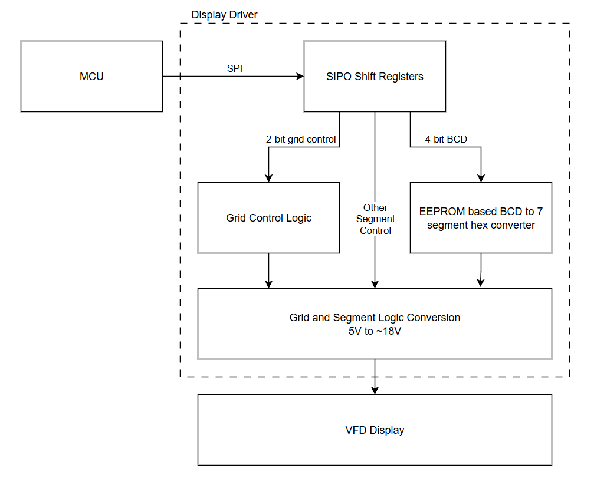
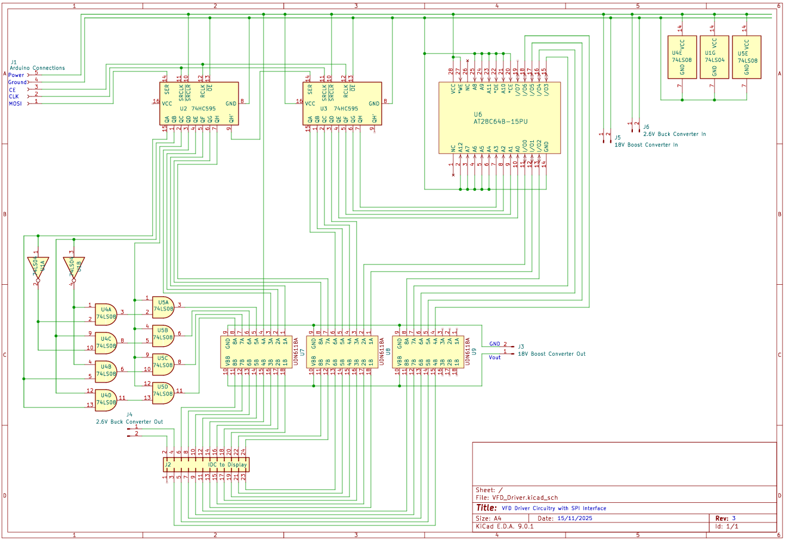
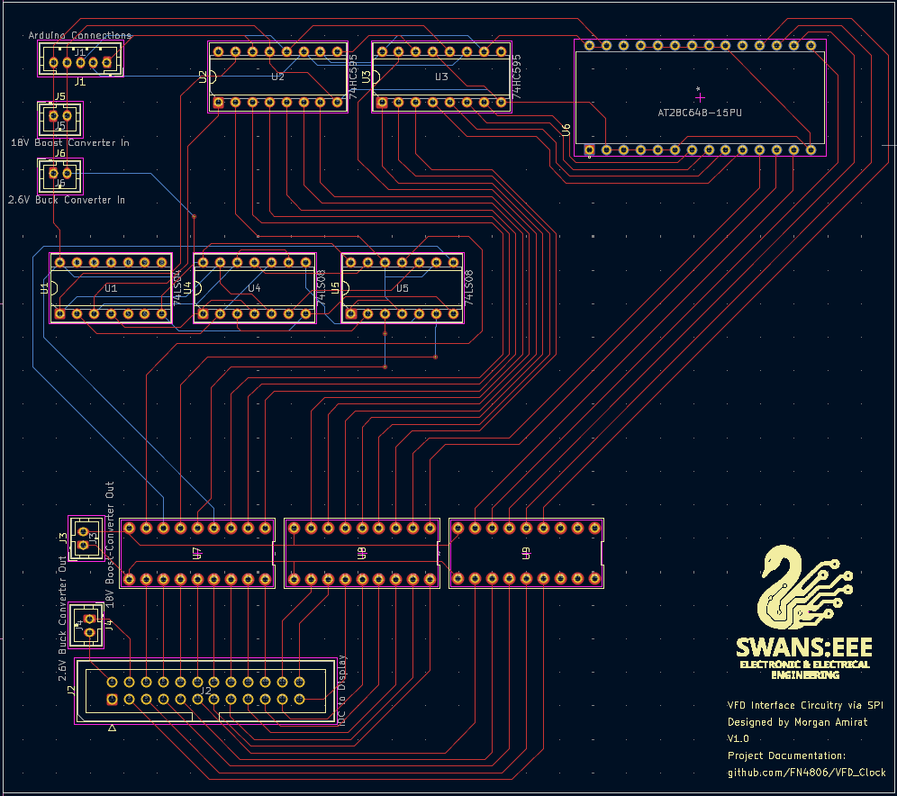

# **Vacuum Flourecent Display Clock Project**

## Features

#### Current: 
- Date and Time Viewing
- Date and Time Setting 
- Temperature Sensing Mode
- Day of the Week Indicator
- RTC Module for Accurate Timekeeping

#### Planned:
- Alarm 
- Custom PCB
- Custom Enclosure

## Hardware

#### Equipment Used:
- 2x Standard Breadboards
- Bench Power Supply
- Bench Oscilloscope for Debugging
- Handheld Multimeter for Debugging
- Various Hand tools
  - Wire Stripper
  - Pliars
  - Tweezers
  - Flathead Screwdriver

#### Components Used: 
- Arduino Nano Every Microcontroller
- Unknown Origin VFD
- Real-Time Clock Module
- LM75 Temperature Sensing Module
- Custom BCD to Hexidecimal Segment Decoder
  - Using 1x AT28C64B-15PU EEPROM IC
- SPI Interfacing
  - Using 2x SN74HC595N Shift Registers
- Discrete Segment Control Logic
  - 2x SN74HC08N AND ICs
  - 1x SN74LS04N NOT IC
- Segment Voltage Control Chips
  - 3x AN6118 ICs
- Voltage Converters for Segment and Filament Voltages
  - ~2.6V Buck Converter for Filament Voltage 
  - ~18V Boost Converter for Segment Voltage

## Firmware

## Circuit & Design   

#### Initial Block Diagram:

#### Current Circuit Diagram:

#### PCB Design:

This is the first design for a PCB for this project, and as such it is not without it's bugs! However, the PCB is functional and the clock still works.
Firstly, the 4-bit address bus connected to the eeprom is wired in reverse, this was fixed in software using a function to flip the bits around.
Secondly, the footprint used for the 5-pin JST connected was incorrect for the style I had, to rectify this I simply soldered some wires directly to the pad. 

In the next redesign, I need to fix the two existing hardware bugs, but also I would like to reduce the size of the PCB with some layout optimisation. 